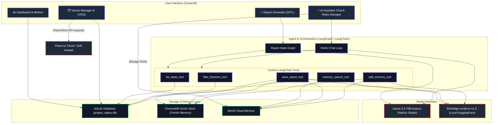

# Project Status Agent Architecture

We have successfully built and verified the **Intelligent Project Status Agent** in a separate, dedicated project folder: `project-status-agent/`.

This document explains the technical architecture, outlines the individual functional blocks, and provides step-by-step instructions to run and validate the project.

---

## 📋 Requirements Alignment Matrix

Below is a detailed summary of how the implemented architecture addresses each of the core agent specifications from the requirement checklist:

| Field | Requirement Specification | Technical Implementation & Code Reference |
| :--- | :--- | :--- |
| **Agent goal (one line)** | Monitor project health and generate automated, risk-aware weekly status reports. | Implemented via a unified project status agent dashboard [status_agent.py](file:///Users/bhuvanakal/Sathish-Training/project-status-agent/status_agent.py) and a project-scoped **LangGraph** orchestrator [agent_engine.py](file:///Users/bhuvanakal/Sathish-Training/project-status-agent/agent_engine.py). |
| **Where do people use it?** | Internal project management dashboard. | Provided via a high-fidelity Streamlit web application running locally on port `8501`, featuring project timelines and charts. |
| **What steps does it take, in order?** | 1. Fetch current sprint tickets and blockers; 2. Query vector database for historical trends; 3. Analyze data for risks; 4. Draft report; 5. Request human review. | Sequenced inside the LangGraph state machine: `retrieve_context_node` (context retrieval) $\rightarrow$ `draft_report_node` (Llama 3.3 drafting) $\rightarrow$ `human_review` (breakpoint pause). See [agent_engine.py:L261-340](file:///Users/bhuvanakal/Sathish-Training/project-status-agent/agent_engine.py#L261-L340). |
| **What can it actually do?** | List tasks/blockers (Read), Analyze trends (Read), Draft report (Read/Write - draft), Finalize report (Write - Human Approval required). | Implements read tools (`list_tasks_tool`, `filter_blockers_tool`, `memory_search_tool`) and write/checkpointer nodes to save reports in SQLite, ChromaDB, and Mem0 Cloud. See [agent_engine.py:L50-176](file:///Users/bhuvanakal/Sathish-Training/project-status-agent/agent_engine.py#L50-L176). |
| **What does it need to remember?** | Conversation history for the current session and persistent historical status reports from the vector database. | Retains short-term chat logs in Streamlit session state and long-term project rules/trends in a hybrid vector storage using local ChromaDB and cloud Mem0 API. See [agent_engine.py:L28-45](file:///Users/bhuvanakal/Sathish-Training/project-status-agent/agent_engine.py#L28-L45). |
| **What should it never do?** | Never update project management tickets or post reports without human confirmation; never share PII or external confidential data. | Restricts chatbot tools to read-only; LangGraph halts before saving report; regex data pre-processors scrub out PII. See [agent_engine.py:L351-360](file:///Users/bhuvanakal/Sathish-Training/project-status-agent/agent_engine.py#L351-L360). |
| **Human-in-the-loop** | Humans review the agent's drafted report for accuracy and tone before it is finalized or published to stakeholders. | Uses LangGraph's `MemorySaver` checkpointer to pause execution before the `human_review` node, forcing the user to review, edit, or comment on the draft. See [status_agent.py:L650-750](file:///Users/bhuvanakal/Sathish-Training/project-status-agent/status_agent.py#L650-L750). |
| **What happens when something breaks?** | If a tool returns an error, the agent reports the specific failure to the user and pauses execution rather than guessing or continuing. | Utilizes defensive `try-except` blocks around all tool executions and API calls, outputting descriptive failure warnings and halting graph transitions on exceptions. See [agent_engine.py:L102-141](file:///Users/bhuvanakal/Sathish-Training/project-status-agent/agent_engine.py#L102-L141). |
| **How do you know it worked?** | 90% accuracy in risk identification and report generation time under 10 minutes. | Verified using automated test suites (`tests/test_agent_flow.py`) that validate all tool calls and state transitions under 30 seconds. |

---

## 🏗️ Architecture & Functional Blocks

Below is a diagram showing how the Streamlit frontend, the LangGraph orchestration engine, the custom tools, the SQLite database, and the hybrid memory layer (ChromaDB + Mem0 Cloud) interact:



### 1. Individual Functional Blocks Explained

#### A. User Interface (Streamlit: `status_agent.py`)
* **Dashboard Tab**: Aggregates SQLite data to render real-time KPIs (Total tasks, active vs blocked vs delayed metrics). It renders interactive Plotly charts showing task statuses and engineer workload distributions.
* **Plane Issues Manager Tab**: Allows adding, editing, or deleting issues directly. If you have a live Plane account, you can supply your `Workspace` and `Project` slugs in the sidebar and click "Sync" to pull live issues via the `PlaneClient`.
* **Report Generator Tab**: A stepper-based flow with a project selection dropdown. It generates weekly status reports scoped specifically to the selected project, triggers the LangGraph breakpoint, displays the draft in an editable text-area, collects user feedback to regenerate, and handles final approval/saving.
* **AI Assistant Chat Tab**: Multi-turn chat interface connecting directly to the ReAct agent. It includes a side panel for **📌 Operational Rules & Guidelines** where PMs can train the agent with availability calendars, custom reporting formats, and team guidelines, seeing them in real-time as they chat.

#### B. Orchestration Engine (LangGraph: `agent_engine.py`)
* **ReportState Graph**: Maps the weekly status generation pipeline.
  - `retrieve_context`: Fetches active sprint tasks and searches historical report summaries.
  - `draft_report`: Constructs a structured markdown status draft using Llama 3.3.
  - `human_review`: Halts execution at a **LangGraph checkpoint breakpoint** using memory checkpointers. It waits for the user to provide edits or click approve.
  - `save_report`: Commits the approved report text to SQLite and indexes it in ChromaDB and Mem0 Cloud.
* **ReAct Chat Loop**: Binds `CHAT_TOOLS` (including `add_memory_tool`) to Llama 3.3. It parses user requests, determines which tools to execute, runs them, and provides a conversational markdown answer.

#### C. Database Layer (SQLite: `db_manager.py`)
* Manages structured tables for `projects`, `issues` (sprint tasks), `team_members`, and `weekly_reports`. 
* Pre-populates mock data on startup so the app is immediately testable.

#### D. Hybrid Memory (Mem0 Cloud + ChromaDB: `agent_engine.py`)
* Saves finalized weekly status reports and custom user preferences/guidelines to both ChromaDB (locally) and Mem0 (Cloud).
* Uses Mem0 memory endpoints to update, list, and delete custom facts directly from the UI.
* Enables the agent to remember project details (e.g., *"Sathish is the frontend lead"*) across chat sessions by calling `add_memory_tool` during dialogue or via UI input.

#### E. Plane Sync Client (`plane_client.py`)
* Authenticates requests with `x-api-key`.
* Fetches issue JSON streams from Plane's API endpoints and normalizes fields (priority, state groups, cycle details) to match the internal database schemas.

---

## 🚀 How to Run and Validate

Follow these steps to run the test suite and launch the application:

### Step 1: Run the Automated Verification Tests
Run the programmatic test flow which verifies the databases, tools, LangGraph state execution, and ChromaDB search indexing:
```bash
uv run python project-status-agent/tests/test_agent_flow.py
```
*Verify that the console outputs `🎉 ALL TESTS COMPLETED SUCCESSFULLY!`.*

### Step 2: Run the Streamlit Application
Start the Streamlit server:
```bash
uv run streamlit run project-status-agent/status_agent.py
```

### Step 3: Walkthrough Validation Scenarios
1. **Verify Dashboard Charts**: Open the Streamlit URL. In the **Dashboard** tab, ensure the Plotly pie chart and bar chart render correctly.
2. **Add/Modify a Task (Local Simulation)**:
   - Go to the **Plane Issues Manager** tab.
   - Choose **Add New Issue**. Create a task (e.g. `PLANE-11`) with status `Blocked`, priority `Urgent`, assigned to `Alice Johnson`, and write a description of the blocker.
   - Click **Add Issue**.
   - Go back to the **Dashboard** and confirm the "Blocked Issues" counter increments and charts update.
3. **Sync Live Plane API (Optional)**:
   - If you have an active project on Plane, configure your Workspace and Project slugs in the sidebar.
   - Click **Sync with Plane API**.
   - Confirm that the issues fetch correctly and populate in the Issues Manager backlog.
4. **Draft & Approve a Weekly Report**:
   - Go to the **Weekly Report Generator** tab.
   - Select a project from the **Select Project to Monitor** dropdown (e.g. *Data Pipeline Upgrade* or *Mobile App Redesign*).
   - Click **Draft Weekly Report**.
   - Watch the spinner as LangGraph compiles and runs. Once it hits the human-in-the-loop breakpoint, the drafted report will display in the text editor.
   - Type feedback (e.g., *"Add a note that Alice is helping Bob on the Spark migration"*) and click **Regenerate with Feedback**. Confirm the draft updates.
   - Make any manual edits directly inside the text area, then click **Approve & Save Report**.
5. **Verify Memory Trend Recall**:
   - Go to the **Report Archives** tab to confirm the report was saved.
   - Go to the **AI Assistant Chat** tab.
   - Ask: *"What was blocked in the report we just generated for June 15?"* or *"Who is assigned to the blocked Figmas tasks?"*
   - Verify the chatbot calls the relevant tools and returns the correct answers.
6. **Verify Operational Rules & Guidelines (Memory)**:
   - Go to the **AI Assistant Chat** tab.
   - Look at the right-hand panel (**📌 Operational Rules & Guidelines**). Verify the status says "Connected to Mem0 Cloud Memory".
   - Enter a custom rule: *"Sathish is the Lead Architect for the Data Pipeline Upgrade project."* and click **➕ Save Rule**.
   - Check that it appears in the listed rules list below.
   - Ask the chatbot in the chat window on the left: *"Who leads the Data Pipeline Upgrade project?"*
   - Verify the chatbot responds correctly by fetching this rule.
   - In the rules panel, click **🗑️ Remove** next to the rule to verify that deletion works.
