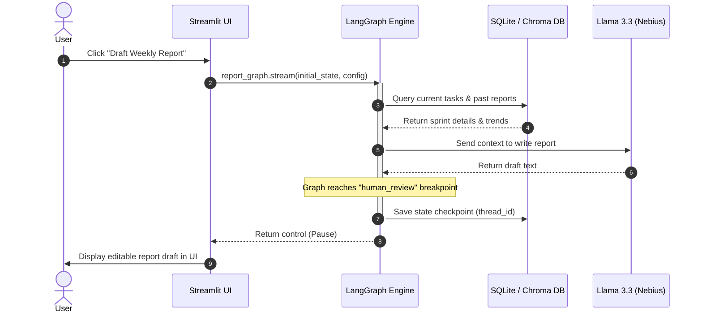
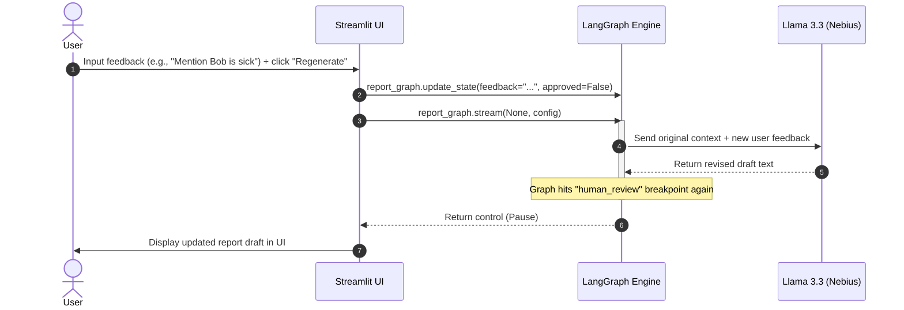
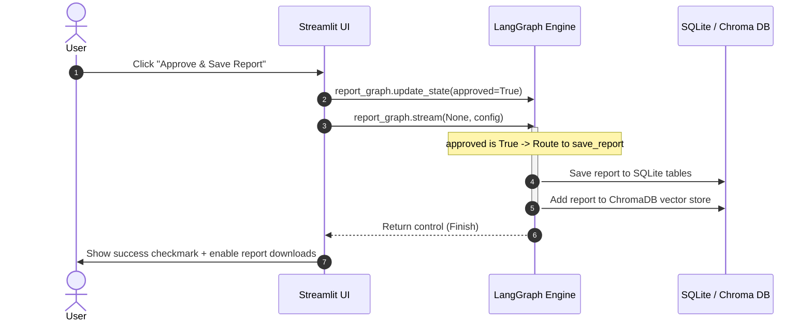

# LangGraph Weekly Report Generator - Visual Flow & Scenarios

This guide provides a pictorial view of the step-by-step state machine execution, highlighting how the application transitions between autonomous agent nodes and human-in-the-loop intervention.

---

## 🗺️ Step-by-Step Flowchart

The diagram below maps the 5 steps of the weekly report generator lifecycle. Notice how the graph is forced to pause at the human review checkpoint:

---

## 🎬 Interaction Scenarios (Sequence Views)

The following diagrams illustrate the communication sequence between the **Streamlit Frontend**, the **LangGraph Orchestrator**, and the **SQLite/Vector Databases** for each of the three user interaction scenarios:

### Scenario A: Initial Drafting (Steps 1–3)
The user initiates the workflow. The graph gathers data, writes the initial layout, and freezes state.

---

### Scenario B: Refinement Feedback Loop (Step 4)
The user reviews the draft, identifies a correction or missing fact, inputs text feedback, and requests a rebuild.

---

### Scenario C: Final Approval & Archiving (Step 5)
The user is satisfied with the text, approves it, and the system permanently commits it to memory.

