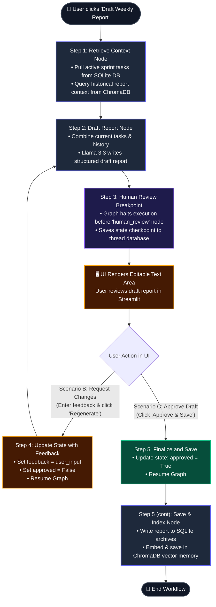
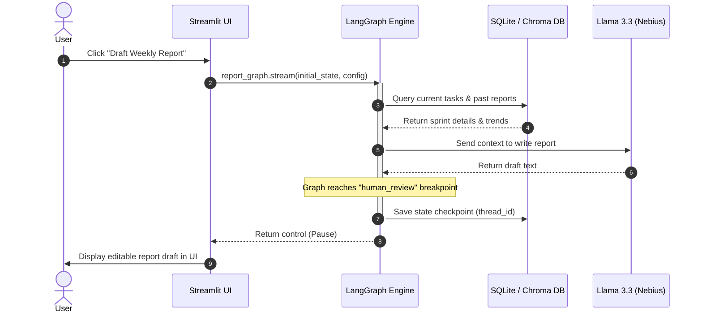
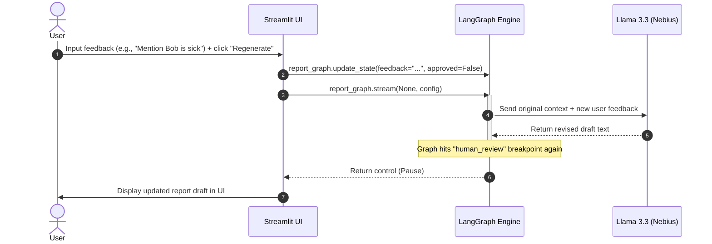
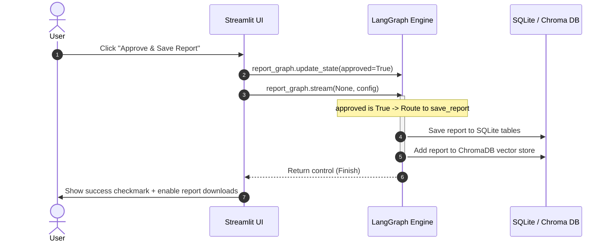
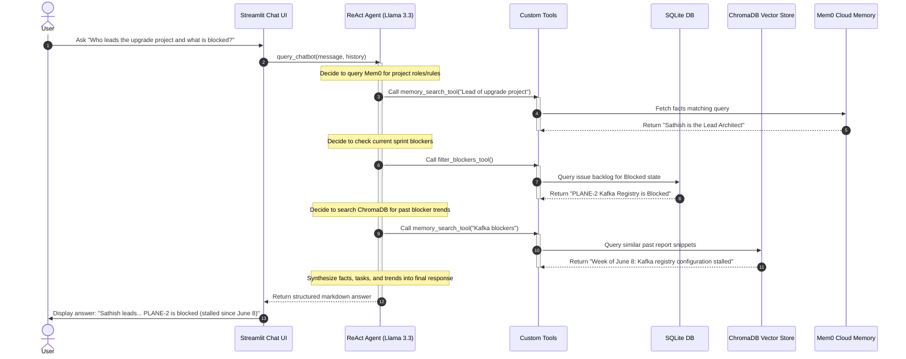

# LangGraph Weekly Report Generator - Visual Flow & Scenarios

This guide provides a pictorial view of the step-by-step state machine execution, highlighting how the application transitions between autonomous agent nodes and human-in-the-loop intervention.

---

## 🗺️ Step-by-Step Flowchart

The diagram below maps the 5 steps of the weekly report generator lifecycle. Notice how the graph is forced to pause at the human review checkpoint:

---

## 🎬 Interaction Scenarios (Sequence Views)

The following diagrams illustrate the communication sequence between the **Streamlit Frontend**, the **LangGraph Orchestrator**, and the **SQLite/Vector Databases** for each of the three user interaction scenarios:

### Scenario A: Initial Drafting (Steps 1–3)
The user initiates the workflow. The graph gathers data, writes the initial layout, and freezes state.

---

### Scenario B: Refinement Feedback Loop (Step 4)
The user reviews the draft, identifies a correction or missing fact, inputs text feedback, and requests a rebuild.

---

### Scenario C: Final Approval & Archiving (Step 5)
The user is satisfied with the text, approves it, and the system permanently commits it to memory.

---

## 🧠 Components & Data Flow (How ReAct, Mem0, SQLite, and ChromaDB are involved)

Here is a detailed breakdown of how each component is involved during different stages of the application lifecycle:

### 1. SQLite Database (`project_status.db`)
* **When it is involved**: Ground-truth data storage.
* **Usage**:
  - Used by `list_tasks_tool` and `filter_blockers_tool` to query active tasks and dependencies.
  - Used by the Streamlit dashboard to render KPI cards, Plotly stacked bar charts, and timeline stages.
  - Used by the `save_report_node` to save the final approved markdown report.

### 2. ChromaDB (Local Vector Database)
* **When it is involved**: Historical report search and week-over-week trend analysis.
* **Usage**:
  - When the report is approved (`save_report_node`), it is embedded using the `BAAI/bge-small-en-v1.5` local model and stored inside the `chroma_db/` folder.
  - When the ReAct Agent is asked about past performance trends, it triggers `memory_search_tool` to run a semantic search across the ChromaDB database to retrieve the top 3 matching report snippets.

### 3. Mem0 Cloud (Atomic Memory Engine)
* **When it is involved**: Guidelines, calendars, and user-defined operational rules storage.
* **Usage**:
  - When a user inputs a rule in the **Operational Rules** panel, it is saved directly to Mem0 Cloud via `mem0_client.add()`.
  - When the ReAct Agent is asked a question, it queries Mem0 Cloud using `memory_search_tool` to pull relevant facts.
  - The ReAct Agent can autonomously add facts from conversation context by invoking `add_memory_tool`.

---

### 💬 ReAct Chat Loop & Memory Interaction

When a user asks a question in the **AI Assistant Chat**, Llama 3.3 acts as a reasoning engine, deciding dynamically which tools to run to compile the answer:

